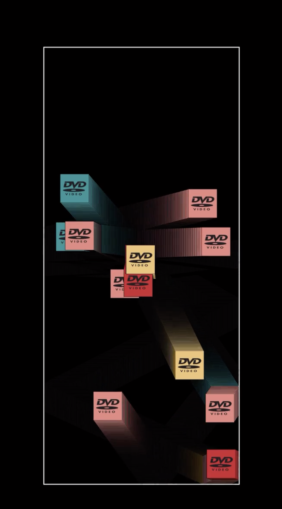

# XIHU0279_9103_TUT5
My first repository for IDEA9103

## Part 1: Imaging Technique Inspiration
Artist：Chris barber

Works：adding a dvd box every time it bounces off the wall until my computer crashes

Inspiration thinking：

1. Set shapes to be active within a specified range. 
- Being able to control the position of the dynamic effects of shapes allows for better mastery of the visual presentation of animations.

2. Shapes that collide with the rectangular boundary can fissure into an endless stream of new shapes. 
- The fissuring effect can increase the visual impact and add interest.

## Part 2: Coding Technique Exploration

（1）

[Link Text](https://p5js.org/examples/motion-bounce.html)

（2）

[Link Text](https://editor.p5js.org/ms12297/sketches/XAQwqAwOK)

Technical discussion：

1. Through `setup()`, the canvas and the initial position of the circle are initialized, while `draw()` updates the position of the circle each frame, checks for boundary collisions, and adjusts its movement direction when the circle touches the boundary.

2. The code achieves a dynamic and interactive visual effect by updating the circle's position and color using the `update()` method, checking for boundary collisions and replicating circles with the `replicate() `method, and combining these operations with the `run()` method. The `setup() `function initializes the canvas and circles, while the` draw()` function loops to render the canvas and update the circles.